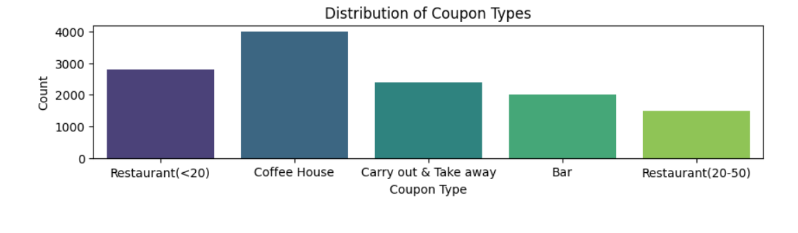

<h1>Will-a-Customer-Accept-the-Coupon?<h1>

The main goal of this project is to utilize Python libraries, particularly Pandas, Seaborn, Matplotlib, and Numpy, to analyze and visualize data. The project specifically focuses on predicting the likelihood of drivers, whether with or without passengers, accepting or rejecting coupons. The analysis relies on conditional probabilities for prediction.

<h3>Python is employed as the primary programming language, enabling a thorough data analysis process.<h3> 
    The Pandas, Seaborn, Matplotlib, and Numpy libraries play a crucial role in visualizing patterns and relationships within the dataset.

A comprehensive analysis, including observations and comments, is meticulously documented in the client's notebook, serving as the primary reference for all completed project tasks.
<a> href="http://localhost:8888/notebooks/prompt.ipynb" >Link to jupyter</a>

It's important to note that certain columns (Car, Bar, Cafe, Carry Away, RestaurantLessThan20, Restaurant20To50) contain missing values, indicating potential data gaps that could impact the analysis.

One significant finding from the conditional probability analysis is that drivers who accept the "Coffee House" coupon demonstrate the highest probabilities compared to those accepting "Restaurant (<20)" and "Run and pick up" coupons. This insight is effectively depicted through barplots, providing a clear visualization of the observed conditional probabilities.

<h3>Formulating a hypothesis to examine the disparity between individuals visiting the bar 1-3 times a month and those frequenting the bar more than 3 times, I organized the data on coupon acceptance. Subsequently, I scrutinized other columns, and the analysis yielded the following insights:<h3>
The visualization reveals a pronounced trend, indicating that individuals who accept coupons and visit bars between 1 and 3 times a month are more inclined to do so compared to those who frequent bars more than 3 times. This insight suggests a correlation between coupon acceptance and a moderate frequency of bar visits.

The heightened likelihood of accepting coupons within the demographic that engages with bar moderately could be indicative of a balanced engagement with the social setting, making this group more receptive to promotional incentives.

